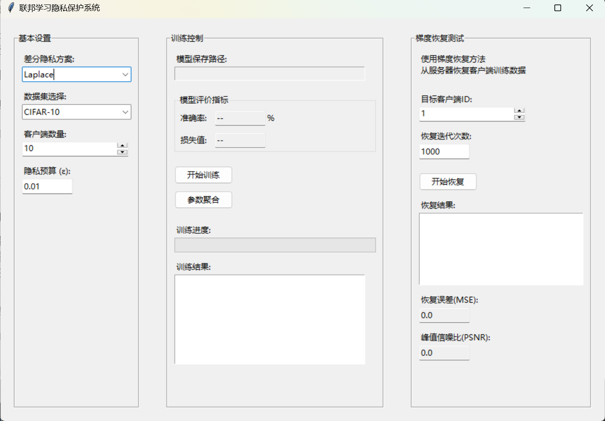

### 项目结构

FederatedLearningPrivacy/
├── data/                          # 数据集存放目录
│   ├── dataset1/
│   ├── dataset2/
│   ├── preprocess.py              # 数据预处理脚本
│   ├── loaders.py                 # 数据加载脚本
├── models/                        # 模型相关代码
│   ├── base_model.py              # 模型定义基类
│   ├── resnet.py                  # ResNet 模型
│   ├── __init__.py                # 模块初始化
├── clients/                       # 客户端相关代码
│   ├── client.py                  # 客户端逻辑实现
│   ├── privacy_schemes.py         # 差分隐私保护方案实现
├── server/                        # 服务器端相关代码
│   ├── server.py                  # 服务器端逻辑实现
│   ├── aggregation.py             # 模型聚合实现
├── utils/                         # 工具函数模块
│   ├── metrics.py                 # 评价指标
│   ├── visualization.py           # 数据和实验结果可视化
│   ├── logger.py                  # 日志记录工具
├── experiments/                   # 实验测试相关
│   ├── experiment1.py             # 实验 1：不同隐私保护程度测试
│   ├── experiment2.py             # 实验 2：客户端数量测试
│   ├── experiment3.py             # 实验 3：数据恢复实验
├── configs/                       # 配置文件目录
│   ├── default_config.json        # 默认配置
│   ├── dataset1_config.json       # 数据集1配置
│   ├── dataset2_config.json       # 数据集2配置
├── requirements.txt               # 项目依赖列表
├── README.md                      # 项目说明文档
└── main.py                        # 程序入口
 仅供参考

### GUI界面



### 差分隐私三种方案

#### 1.Laplace拉普拉斯机制

- **确定敏感度和隐私预算**：在联邦学习的客户端，首先需要计算模型参数更新或数据查询函数的敏感度Δf

  ，这通常通过分析相邻数据集对模型输出或查询结果的影响来确定。同时，设定隐私预算，它决定了隐私保护的强度。

- **计算噪声参数**：根据拉普拉斯机制的原理，计算添加噪声的参数ε，公式为:
  $$
  b = \frac{\Delta f}{\epsilon}
  $$
  这个参数控制着拉普拉斯分布的形状，决定了噪声的大小和分布特性。

- **添加噪声**：生成服从拉普拉斯分布Lap(0,b)的噪声z，并将其添加到模型参数或查询结果中。若对模型参数w进行隐私保护，则更新后的参数为:
  $$
  w' = w + z
  $$
  

- **上传或使用扰动后的数据**：客户端将添加噪声后的模型参数上传至服务器进行聚合，或者在本地使用扰动后的数据进行后续计算。服务器在接收到多个客户端的扰动参数后，进行模型聚合操作，由于噪声的存在，服务器难以从聚合结果中推断出客户端的原始数据，从而保护了数据隐私。

  ```python
  import numpy as np
  
  def laplace_mechanism(data, epsilon, sensitivity):
      """
      实现拉普拉斯机制添加噪声
      :param data: 原始数据
      :param epsilon: 隐私预算
      :param sensitivity: 敏感度
      :return: 添加噪声后的数据
      """
      # 计算拉普拉斯分布的参数 b
      b = sensitivity / epsilon
      # 生成拉普拉斯噪声
      noise = np.random.laplace(0, b)
      # 添加噪声到原始数据
      noisy_data = data + noise
      return noisy_data
  
  # 示例使用
  original_data = 10
  epsilon = 0.1
  sensitivity = 1
  noisy_result = laplace_mechanism(original_data, epsilon, sensitivity)
  print(f"原始数据: {original_data}, 添加拉普拉斯噪声后的数据: {noisy_result}")
  ```

  

#### 2.高斯机制流程

- **计算敏感度和隐私参数**：与拉普拉斯机制类似，先确定模型参数或数据查询的敏感度，以及隐私预算ε和辅助参数δ（用于 (ε，δ)-DP 定义）。

- **推导噪声标准差**：根据高斯机制满足 (ε，δ)-DP 的条件，推导所需添加高斯噪声的标准差σ。在不同的联邦学习算法中，计算的公式有所不同，如在 UDP 算法中，
  $$
  \sigma_{i}=\frac{\Delta \ell\sqrt{2qT\ln(1/\delta_{i})}}{\epsilon_{i}}
  $$
  ，其中涉及到局部训练过程的敏感度、采样比、通信轮数等因素。

- **添加高斯噪声**：生成均值为 0、标准差为的高斯噪声，并将其添加到模型参数或数据上。如在客户端训练模型后，将噪声添加到模型参数上，得到：
  $$
  w' = w + N(0,\sigma^{2})
  $$

- **模型聚合与应用**：客户端上传添加噪声后的模型参数，服务器进行聚合操作。由于高斯噪声的特性，在保证一定隐私保护的同时，能相对较好地维持模型的性能，使模型在聚合后仍能保持一定的准确性和收敛性。

  ```python
  import numpy as np
  
  def gaussian_mechanism(data, epsilon, delta, sensitivity):
      """
      实现高斯机制添加噪声
      :param data: 原始数据
      :param epsilon: 隐私预算
      :param delta: 辅助隐私参数
      :param sensitivity: 敏感度
      :return: 添加噪声后的数据
      """
      # 计算高斯噪声的标准差
      sigma = np.sqrt(2 * np.log(1.25 / delta)) * sensitivity / epsilon
      # 生成高斯噪声
      noise = np.random.normal(0, sigma)
      # 添加噪声到原始数据
      noisy_data = data + noise
      return noisy_data
  
  # 示例使用
  original_data = 10
  epsilon = 0.1
  delta = 1e-5
  sensitivity = 1
  noisy_result = gaussian_mechanism(original_data, epsilon, delta, sensitivity)
  print(f"原始数据: {original_data}, 添加高斯噪声后的数据: {noisy_result}")
  ```

  

#### 3.指数机制流程

- **定义效用函数和确定敏感度**：在客户端，针对模型参数或数据查询定义一个效用函数，用于衡量不同输出对于查询函数在数据集上的效用。同时确定查询函数的敏感度。

- **计算输出概率分布**：根据指数机制的公式，计算每个可能输出的概率分布。这里的是隐私预算，它控制着概率分布的集中程度。
  $$
  Pr[o]=\frac{e^{\frac{\epsilon \cdot u(f(x), o)}{2 \Delta f}}}{\sum_{o^{\prime}} e^{\frac{\epsilon \cdot u(f(x), o^{\prime})}{2 \Delta f}}}
  $$
  

- **随机选择输出**：按照计算得到的概率分布，随机选择一个输出。这个输出就是经过隐私保护后的结果，可以用于上传至服务器或本地使用。

- **服务器处理与模型更新**：服务器接收到多个客户端的隐私保护输出后，进行相应的处理和模型更新操作。指数机制通过概率分布的方式，在保护隐私的同时，尽可能地保留数据的有用信息，以支持模型的学习和优化。

  ```python
  import numpy as np
  
  def exponential_mechanism(utility_function, epsilon, sensitivity, possible_outputs):
      """
      实现指数机制选择输出
      :param utility_function: 效用函数
      :param epsilon: 隐私预算
      :param sensitivity: 敏感度
      :param possible_outputs: 所有可能的输出
      :return: 选择的输出
      """
      # 计算每个可能输出的得分
      scores = [utility_function(output) for output in possible_outputs]
      # 计算概率分布
      probabilities = np.exp((epsilon * np.array(scores)) / (2 * sensitivity))
      probabilities /= probabilities.sum()
      # 根据概率分布随机选择一个输出
      selected_output = np.random.choice(possible_outputs, p=probabilities)
      return selected_output
  
  # 示例效用函数
  def example_utility_function(output):
      return output  # 简单示例，可根据实际情况修改
  
  # 示例使用
  epsilon = 0.1
  sensitivity = 1
  possible_outputs = [1, 2, 3, 4, 5]
  selected = exponential_mechanism(example_utility_function, epsilon, sensitivity, possible_outputs)
  print(f"从 {possible_outputs} 中通过指数机制选择的输出: {selected}")
  ```

  